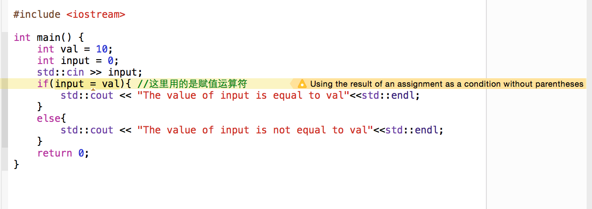

# C++ Primer 第五版 学习笔记
## 第一章 开始
### 1.1 编写一个简单的C++程序

#### ex1.1
```bash
	$ cc proj1.cc
	$ ./a.out
``` 
#### ex1.2
  On Windows:

```bash
	$ echo %ERRORLEVEL%
```

  On Linux and Unix:

```bash
	$ echo $?
```
  在windows中，返回的值是`-1`， 但是在Linux与Unix中，返回`255`


### 1.2 初识输入输出
```c++
	#include<iostream>
	int main(){
		std::cout << "Enter two numbers:" << std::endl;
		int v1 = 0, v2 = 0;
		std::cin >> v1 >> v2;
		std::cout << "The sum of " << v1 << " and " << v2 << " is " << v1 + v2 << std::endl;
		return 0;
	}
```

  其实也可以写成这样，稍微省事一点：
```c++	
	#include<iostream>
	using namespace std;
	int main(){
		cout << "Enter two numbers:" << endl;
		int v1 = 0, v2 = 0;
		cin >> v1 >> v2;
		cout << "The sum of " << v1 << " and " << v2 << " is " << v1 + v2 << endl;
		return 0;
	}
```
  即使用`namespace`来省略掉每次的`std`。见第[第三章](chapter3.md)第3.1节。

  在这里，新手一定要注意的一个问题是: `务必要确定你的分号逗号等等一切符号，都是在英文状态下输入，否则会报一些奇奇怪怪的错误`


#### ex1.3
```c++
		#include<iostream>
		int main(){
			std::cout <<"Hello world." << std::endl;
			return 0;
		}
```

#### ex1.4

```c++
	#include<iostream>
	int main(){
		std::cout << "Enter two numbers:" << std::endl;
		int v1 = 0, v2 = 0;
		std::cin >> v1 >> v2;
		std::cout << "The product of " << v1 << " and " << v2 << " is " << v1 * v2 << std::endl;
		return 0;
	}
```

#### ex1.5
```c++
	#include<iostream>
	int main(){
		std::cout << "Enter two numbers:" << std::endl;
		int v1 = 0, v2 = 0;
		std::cin >> v1 >> v2;
		std::cout << "The product of ";
		std::cout << v1 ;
		std::cout << " and ";
		std::cout << v2; 
		std::cout << " is "
		std::cout << v1 * v2;
		std::cout << std::endl;
		return 0;
	}
```
#### ex1.6

```c++
	std::cout << "The sum of " << v1;
			  << " and " << v2;
			  << " is " << v1 + v2;
```

  此语句不合法，分号`;`意味着当前行的语句结束，对于第二句的操作而言，`<<`操作符没有操作对象，因此会报错。

  可修正为：

```c++
	std::cout << "The sum of " << v1
			  << " and " << v2
			  << " is " << v1 + v2;	
```

### 1.3 注释简介

  C++中的注释有两种格式，一种是双斜线(`//`)的注释，即单行注释；另一种是以`/*` 开始 `*/`结束的注释，称之为`块注释`，即在 `/*`和`*/`之间的语句全部都被注释。

  例如：

```c++
    int sum; // 总和
    if(sum >= 0){
    /*如果 sum >=0 则进行如下操作*/
    }
```

  需要注意的是，块注释不可以嵌套使用，也就是说：
   `/* /* 这是一个错误的注释*/ */`。 
 
  因为编译器会认为 第一个 `/*`的注释在第一个`*/`处结束。


#### ex1.7
    请自行尝试

#### ex1.8

```c++
	std::cout << "/*"; // 合法
```
```c++
	std::cout << "*/"; // 合法
```
```c++
	std::cout << /* "*/" */ ; // 不合法
```
```c++
	std::cout << /* "*/" /* "/*" */; // 合法
```
  报错信息为

```bash
prog1.cc:5:22: warning: missing terminating '"' character [-Winvalid-pp-token]
                std::cout << /* "*/" */;
                                   ^
prog1.cc:5:22: error: expected expression
1 warning and 1 error generated.
```
  改正方法很简单，添加一个引号即可：

```c++
	std::cout << "/*";
	std::cout << "*/";
	std::cout << /* "*/" */";
	std::cout << /* "*/" /* "/*" */;
```

### 1.4 控制流
  控制流是程序设计语言中非常重要的一部分，C++中的控制流有很多，比如选择、判断、循环等等。这里先主要介绍两种循环： `while`循环 和`for`循环。

  `while`语句反复执行一段代码，直至`while`中的判断语句为假时结束。

  例如，使用while语句求1到10这十个数之和：

```c++
    #include<iostream>
    using namespace std;
    int main(){
        int sum = 0, val = 1;
        while(val <= 10){
            sum += val; // 将sum + val 赋值给sum
            ++val; // 将val+1
        }
        cout<< "Sum of 1 to 10 is: " << sum <<endl;
        return 0;
    }
```
  `while`语句的意思是，当`while(condition)`中的`[condition]`为真时，执行`{ }`中的部分，当`[condition]`为假时，结束循环。

  `for`语句的括号中有三个参数，分别是循环初始条件、循环判断以及运算。举个例子：

```c++
    /*计算 1到100 这100个数的和*/
    int sum = 0;
    for(int i=1; i <= 100; i++){
        sum += i;
    }
    std::cout<< sum; // 结果为5050
```
  分析一下这段代码，首先申明了一个int类型的变量`sum`，然后是一个`for`循环。

```
    for(int i=1; i <= 100; i++){
        // do something
    }
```
  第一个分号前的`int i=1;`表示循环初始化，在这个循环开始的时候，i的值为1；

  第二个分号前的`i <= 100`表示循环判断，当`i <= 100`的时候循环进行，当`i > 100`时，循环结束；

  第三个分号前的`i++`表示，每当循环进行一次的时候，执行一次`i++`操作，及每次执行代码后，变量`i`的值会`+1`。


`do while`循环在学习的时候使用较少，在这里暂且跳过。

  这里出现了一些运算符，如 ++val、val--等等，关于这些运算符的概念及具体应用，在[第四章 表达式](chapter4.md)中会详细学习讨论。在这里我们仅仅需要知道 `++val` 的意思是让`val`自己给自己`+1`即可。

    关于运算符的一些小概念： 
    自增运算符: ++;
    自减运算符: --;
    复合赋值运算符: +=、-=、 *=、 /=等等；


#### ex1.9

```c++
	#include <iostream>
	int main() {
	    int sum = 0, val = 50;
	    while (val <= 100) {
	        sum += val;
	        ++val;
	    }
	    std::cout<< "Sum of 50 to 100 inclusive is " << sum << std::endl;
	    return 0;
	}
```

#### ex1.10 

```c++
	#include <iostream>
	int main(int argc, const char * argv[]) {
	    int val = 10;
	    while (val >= 0) {
	        std::cout << val << std::endl;    
	        --val;
	    }
	    return 0;
	}
```

#### ex1.11
```c++
	#include <iostream>
	int main() {
		int min = 0, max = 0;
		std::cout << "Input two numbers:"<<std::endl;
		std::cin >>min>>max;
		if(min > max){
			std::swap(min, max);
		}
		while(min < max){
			std::cout << min <<std::endl;
			++min;
		}
		return 0;
	}
```

#### ex1.12
```c++
	int sum = 0;
	for (int i = -100; i <= 100; ++i){
		sum += i;
	}
```
  从-100一直累加到100，故最终`sum=0`， 可以使用`std::cout<<sum;`来获取值。

#### ex1.13
```c++
	int sum = 0;
	for (int i = 50; i <= 100; ++i){
		sum += i;
	}
```
```c++
	for (int i = 10; i >= 0; --i){
		std::cout << i <<std::endl;
	}
```
```c++
	int min = 0, max = 0;
	if (min > max){
		std::swap(min, max);
	}
	std::cin >> min >> max;
	for (current = min; current != max; ++current ){
		std::cout << current<< std::endl;
	}
```

#### ex1.14
  对比 for循环 和 while循环 的优缺点：
  在stackoverflow上有一个类似的[问题](http://stackoverflow.com/questions/2950931/for-vs-while-in-c-programming)，可以提供参考。

  在这里提供一些我的个人看法：
	
	在进行无限循环时，使用while(1)来进行循环；
	在进行计数时，使用for(int i=0; i<=100; ++i)类似格式；
	另外还有一种循环do{} while 循环，在进行循环条件判断时，先执行一次操作。
	
	推荐在除了需要死循环外的其它情况下，使用for循环，因为它看起来更加的简洁明了。
	
#### ex1.15
    编译器的常见错误信息，请自行尝试。

#### ex1.16
```c++
    #include <iostream>
    int main()
    {
        int limit = 0, sum = 0, value = 0;
        std::cout << "How many integers would you like to enter?";
        std::cin >> limit;

        // assume we don't know what is EOF(End-Of-File).
        while (std::cin >> value && (--limit != 0))
            sum += value;

        std::cout << sum + value << std::endl;

        return 0;
    }
```


  `if`语句表示条件的判断，`if(condition)`表示，如果`[condition]`为真时，进入`if`结构体执行代码，否则不执行。

  继续使用例子来解释：

```c++
    int min=0, max=0;
    std::cin >> min >> max;
    if(max < min){
        int temp = max; // 临时变量 temp
        max = min;      // 把min的值赋给max
        min = temp;     // 将原来的max的值赋给min
    }
```

  这段代码的意思是，当用户输入的`max` 的值比`min`的值还要小的时候，就把`min`和`max`的值互换一下，这样无论用户怎么输入，`max`的值一定大于或等于`min`的值。

  再举个例子:

```c++
    int val = 10;
    int input = 0;
    std::cin >> input;
    if(input == val){
        std::cout << "The value of input is equal to val"<<std::endl;
    }
    else{
        std::cout << "The value of input is not equal to val"<<std::endl;
    }
```

  在这里出现了一些新东西，一个个来解释：

  首先， `==` 这个运算符，需要和`=`运算符区分开，`==`表示`判断`而`=`的意思是`赋值`，这是两个截然不同的概念，刚接触的人很容易写成`if(a=b)`，这句话的意思是`如果 把 b 的值赋给 a `，很显然说不通顺，但是如果`a=b`这个赋值语句可以正常进行的话，这个`if`判断就永真了。比如，还是上面的那个例子：

```c++
    int val = 10;
    int input = 0;
    std::cin >> input;
    if(input = val){ //这里用的是赋值运算符
        std::cout << "The value of input is equal to val"<<std::endl;
    }
    else{
        std::cout << "The value of input is not equal to val"<<std::endl;
    }
```

  可以自己输入一个不等于`val`的值来看看程序执行的结果。某些IDE会在你写出这个判断的时候就进行提醒，比如我用的是Xcode6。



#### ex1.17 ~ ex1.19
    请自行编码解决问题。


### 1.5 类简介
  C++是一门`面向对象程序设计语言`，暂时不需要非常的了解什么是`面向对象`，这是一个很庞大的概念，我们可以一点点的来理解它。

  这一节里主要介绍了一些关于`类(class)`的概念。
  
  首先我们需要明确一下概念：什么是 `类`， 什么是 `对象`。(这里均是[第七章 类](chapter7.md)的内容，我们只需要大概的了解下即可。)
  
  `类`顾名思义，是一种分类，一种划分，比如： `人(Human)`是一个类，`动物(Animal)`是一个类，`鱼(fish)`也可以是个类。这样进行划分之后，世间万物我们都可以认为是不同的类中的`东西`，这个`东西`，可以认为是`对象`，即所谓`面向对象编程`。
  比如在`Class Human{}`这个类里面，有一个人叫做`小明`，小明就是`Human`类的一个对象；在`Class Fish{}`里有一种条鱼叫做`小红`，小红就是`Fish`类的一个对象。
  
  好了到这里为止我们大概的有了一些简单的概念，继续看书。
  
  为了使用类，我们需要了解三件事:
  
  1. 类名是什么？
  2. 这个类是在哪里定义的？
  3. 这个类支持什么操作？ 
  
  例如书上在`Sales_item.h`中定义了一个名为`Sales_item`的类，我们可以通过这样的方法来使用类：
  
```c++
    #include <iostream>
    #include "Sales_item.h"
    int main(){
        Sales_item book; // book是Sales_item类的一个对象
        /* do something */
    }
```

  Sales_item.h我从网站上下载好了并且放在了这里:[Sales_item.h](sources/1/Sales_item.h)


#### ex1.20

```c++
    #include <iostream>
    #include "include/Sales_item.h"
    int main(){
    for (Sales_item item; std::cin >> item; std::cout << item << std::endl);
    return 0;
}
```
#### ex1.21~ex1.22
    请自行编写代码并验证。

#### ex1.23~ex1.24
    请自行编写代码并验证。
  

### 1.6 书店程序

#### ex1.25
    请自行编写代码并验证。