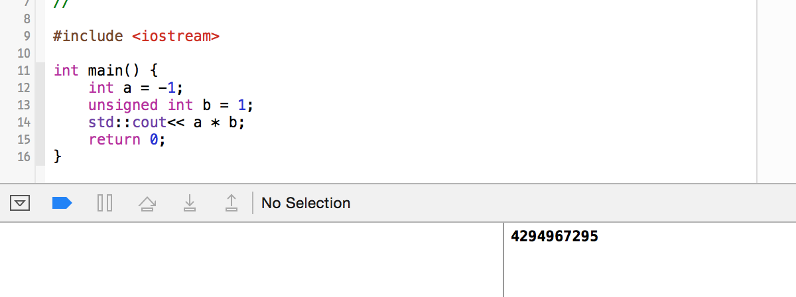
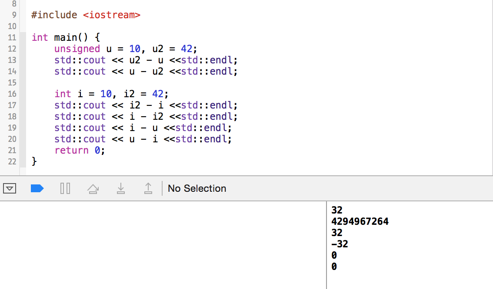

# C++ Primer 第五版 学习笔记
## 第二章 变量和基本类型


	  第一章在某种意义上只是一个引导，大概的描述了一些关于C++程序设计语言的一些特性。
	  第二章开始才是真正的涉及到语言本身的一些语法等等的知识。
	  数据类型是一个语言的基础之一，C++内置了很多的基本类型，比如之前已经接触过的 int 类型等等。
---
### 2.1 基本内置类型

  算数类型分成两类，`整型` 和 `浮点型`。

  整型包括整数、字符和布尔类型等。

   类型       |	   含义     |   最小尺寸   
-------------|--------------|-------------
   bool      |    布尔类型    |    未定义      
   char      | 	   字符	     |     8位       
   wchar_t   |	  宽字符	  |    16位
   char16-t  |  Unicode字符  |	    16位
   char32_t  |  Unicode字符	  |      32位
   short     |	 短整型	     |     16位
   int       |	  整型      |     16位
   long	   |    长整型	     |     32位
 long long   |    长整型	     |     64位
   float	   |  单精度浮点数	  |   6位有效数字
   double	   |  双精度浮点数	  |   10位有效数字
long double  | 扩展精度浮点数  |   10位有效数字


  `布尔类型bool` 表示真假，`true` or `false`，也可以用 `1` 或 `0`来表示真假，通常来说，`1`代表真，`0`代表假。


  除了布尔类型和扩展的字符型之外，其他的整型可以分成`带符号的(signed)` 和 `无符号的(unsigned)`两种。有符号的可以表示正数负数或0，而无符号的则只能表示非负数。
  
  `int`、`short`、`long`和`long long`这几种整型都是带符号的，想要得到无符号的整型也很简单，在相应的整型前加上 `unsigned`即可，如`unsigned int`。
  
  在这里解释一点，带符号的整型和无符号的整型所能表示的数的范围是一定的，比如`int`可以表示的范围是16位的，即 `2^16`，然而差别在于，因为带符号的整型的二进制表示的第一位需要用来表示符号，因此，有符号的`int`能表示的范围从`-2^15到2^15 - 1`，而无符号的`unsigned int`所能表示的数的范围则是从`0到2^16 - 1`。建议这个地方多看几遍，深入理解。
  
  和整型不一样的是，字符型分成了三种，分别是`char`、`signed char`和`unsigned char`。需要注意`char`和`unsigned char`并不相同，而且，虽然字符型有三种，但是却只有带符号和无符号两种表现形式，`char`类型实际上会表现出带符号或者无符号中的一种，具体是哪种由编译器决定。
  
#### ex2.1
    请参考笔记自行总结。

#### ex2.2
    请自行完成。
  
  
  不同的类型之间是可以相互转换的，但是转换的时候需要注意精度问题。
  
  * 当把一个非布尔型的值赋值给一个布尔型的时候，如果初始值为0，则为false，否则全部为true.
  * 当把布尔值赋值给非布尔类型的时候，如果初始值是false，则为0，否则全部为1.
  * 当把浮点值赋值给整型的时候，会丢失精度，仅保存小数点前的部分，小数点后全部舍掉。
  * 当把整数值赋值给浮点类型的时候，小数部分为0，如果整型所占的空间大小大于浮点类型的容量，则可能造成精度损失。
  * 当给一个无符号类型赋值超过它自身表示范围的值的时候，结果是初始值对无符号类型表示数值总数取模之后的余数。(例如，8bits大小的`unsigned char`可以表示0~255之间的值，当我们赋值超过这个范围比如-1的时候，实际的结果是该值对256取模的余数。也就是255)。
  * 当给一个带符号的类型一个超出它自身表示范围的值的时候，结果是**未定义的(undefined)**。此时程序的状态是未知的，可能继续工作，可能直接崩溃，也可能产生垃圾数据。
  
  
  注意不要将带符号类型与无符号类型混用，如书上的例子:
  
  ```c++
    int a = 1;
    int b = -1;
    std::cout << a * b; // 结果为-1 
  ```
  ```c++
    int a = 1;
    unsigned int b = -1;
    std::cout << a * b; // 结果为4294967295
  ```
  
  在我的电脑上的运行结果如下：
  
  


#### ex2.3~ex2.4

```c++
    unsigned u = 10, u2 = 42;
    std::cout << u2 - u <<std::endl;
    std::cout << u - u2 <<std::endl;
    
    int i = 10, i2 = 42;
    std::cout << i2 - i <<std::endl;
    std::cout << i - i2 <<std::endl;
    std::cout << i - u <<std::endl;
    std::cout << u - i <<std::endl;
```
运行一下看看结果：

  
  
  
  接下来讨论一些关于进制的问题。例如：
        
        20   /*十进制*/
        024  /*八进制*/ 
        0x14 /*十六进制*/
    以上三种表示方法均表示十进制数 10      

  以0开头的整数代表八进制数，以0X或者0x开头的代表十六进制数。默认情况下，十进制的字面值是带符号数，而八进制和十六进制字面值可能是带符号的也可能是不带符号的。
  
  `char`和`string`，前者称之为字符型，而后者为字符串，字符串事实上是有常量字符构成的**数组(Array)**。 字符值用单引号表示如：``` 'A' ```，双引号表示字符串如：```"Hello world!"```。
  
  C++中的转义字符包括以下:
  
  字符 | 转义序列 |   字符   | 转义序列
  ------|-------|-------- |--------
  换行符 |  \n   |横向制表符 | \t
  响铃符 | \a    |纵向制表符 | \v
  退格符 | \b    |双引号    | \"
  反斜线 | \\    |单引号    |\'
  问号   | \?    |回车符    | \r
  进纸符  |\f     |     |
  
  举个例子:

```c++
    std::cout << '\n';      // 转到新一行
    std::cout << "\tHi!\n" ;// 输出一个制表符，输出"Hi!"，然后转到新一行
```

  我们可以通过给字面制添加前缀的方法，来制定默认类型，比如我们可以这样：
  
  ```
    L'a'         // 宽字符字面值，类型是wchar_t
    u8"hi!"      // utf-8字符串字面值
    42ULL        // 无符号整型字面值，类型是 unsigned long long
    1E - 3F      // 单进度浮点型字面值，类型是float
    3.14159L     // 扩展精度浮点型字面值，类型是long double
    
    // 虽然可以用大写字母L或者小写字母l来表示长整型字面值，但是建议使用L，因为l与数字1很容易混淆。
  ```
  
对于字符和字符串：

  前缀  |      含义     |  类型
 ------|---------------|-------- 
   u   | Unicode16字符 | char16_t
   U   | Unicode32字符 | char32_t
   L   |   宽字符       |  wchar_t
  u8   |UTF-8(仅用于字符串)| char

对于整型：

   后缀    | 最小匹配类型
----------|----------
 u or U   | unsigned 
 l or L   |  long
 ll or LL | long long 
  
对于浮点型

   后缀    |   类型
----------|-----------
 f or F   |  float
 l or L   | long double 
 
 
#### ex2.5
```
    请参考前面的解析自行完成
```

#### ex2.6
```
    提示：不同的进制
```
#### ex2.7
```
    提示：转义字符与后缀
```
#### ex2.8
```
    std::cout << "2M\n";
    std::cout << "2\tM\n" ;
```

### 2.2 变量

  变量是什么？
  
  考虑一种情况，我们需要计算半径为3的圆的面积，应该怎么做呢？
  
    s = 3^2 * 3.14; 
    
面积为5呢？

    s = 5^2 * 3.14;
    
如果需要改变π的精度呢？
    
    s = 3^2 * 3.1415926;
    
这样写起来是不是太麻烦了？所以有了变量。什么是变量呢？就是把一个可变的值添加一个代号，比如，我们给圆周率取一个名字：`pi`。

    int pi = 3.14;
    int s1 = 3^2 * pi;
    int s2 = 5^2 * pi;

这样的话，如果我们需要修改圆周率的精度，就只需要给`pi`赋值更高的精度就好了，是不是方便多了。

  在使用一个变量之前，需要先声明这个变量，并且初始化这个变量。
  
  声明变量的过程可以看成是，我们在程序中告诉操作系统，我需要一个多大的什么类型的空间去存储一个数据，因此声明变量的基本格式为： [变量类型][变量名]，比如这样：

```c++
    int sum; // 声明但不初始化
    int sum = 0; // 声明并且初始化
    int val = 0, sum = 0; // 申请多个变量并且初始化
```

  初始化即给这个变量一个初始情况的值，未初始化的变量虽然可以直接使用，编译器不会报错，但是却会出现各种奇怪的问题，因此建议在声明一个变量的时候就初始化，可以避免很多不必要的麻烦。
  
```
    需要注意的是，虽然初始化和赋值运算同样都是使用 "=" 来进行操作，但实际的含义却是不同的。
    初始化的含义是在创建变量的时候即赋予一个初始值，而赋值的含义是擦除当前值，并赋予一个新的值。  
```

#### ex2.9 
```c++
    // a
    std::cin >> int input_value; // 错误
    int input_value;
    std::cin >> input_value;
    
    // b
    int i = {3.14}; // 正确，声明了一个列表
    
    // c
    double salary = wage = 9999.99; // 错误
    double salary = 9999.99, wage = 9999.99
    
    //d
    int i = 3.14; // 正确，但是i = 3
    float i = 3.14; // i = 3.14
```

#### ex2.10
```
    std::string global_str;
    int global_int;
    int main(){
        int local_int;
        std::string local_str;
    }
```
![ex2.10] (./screenshots/ch2/ex2.10.png "ex2.10")


